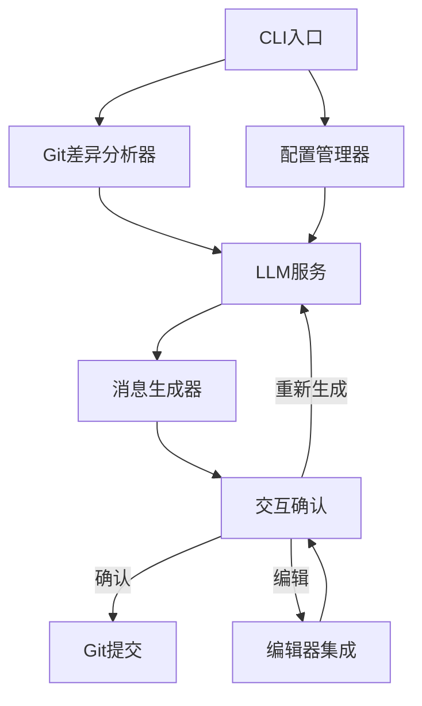
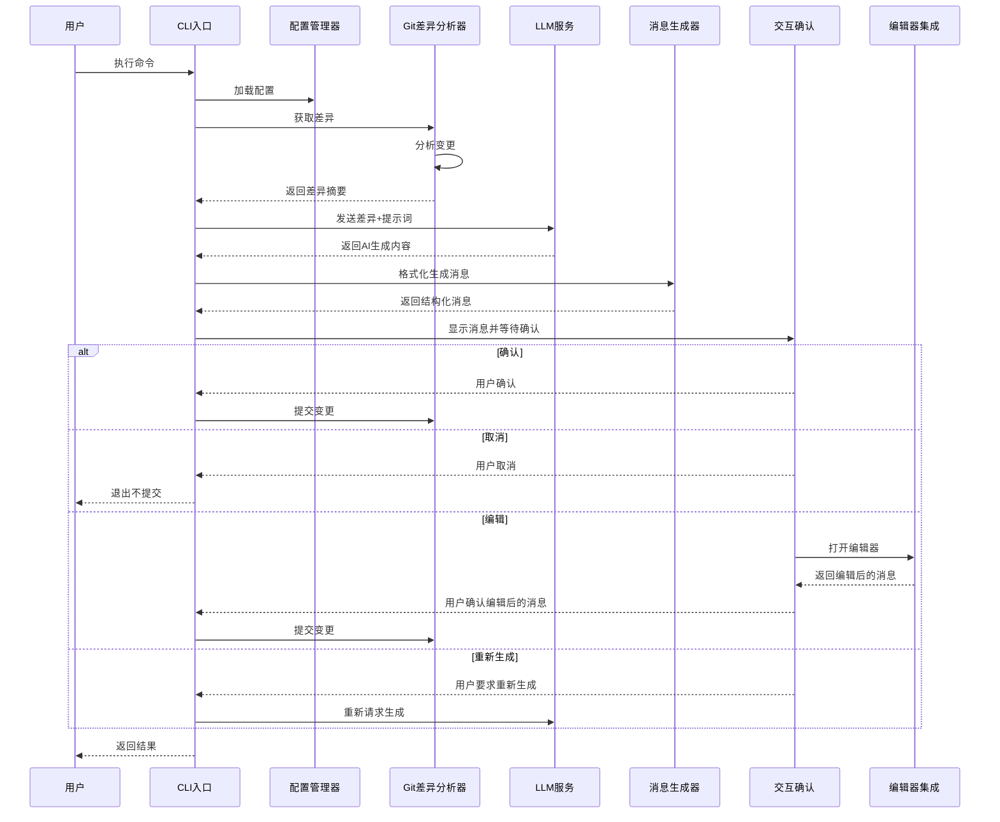

# sf-ai-commit：AI 驱动的 Git Commit 消息生成工具架构设计

## 1. 架构概览



## 2. 主要模块及其职责

### 2.1 核心模块

1. **CLI 入口模块** (`sf_ai_commit/cli.py`)

   - 处理命令行参数和选项
   - 协调各模块的工作流程
   - 提供用户友好的界面和帮助信息

2. **配置管理器** (`sf_ai_commit/config.py`)

   - 读取和解析 YAML 配置文件
   - 管理默认配置和用户自定义配置
   - 提供配置验证功能

3. **Git 差异分析器** (`sf_ai_commit/git_analyzer.py`)

   - 使用 GitPython 获取暂存区的变更
   - 分析文件差异并提取关键信息
   - 生成结构化的差异摘要

4. **LLM 服务** (`sf_ai_commit/llm_service.py`)

   - 基于 PocketFlow 框架实现对 LLM 的调用
   - 管理 API 连接和错误处理
   - 应用提示词工程技术

5. **消息生成器** (`sf_ai_commit/message_generator.py`)

   - 根据差异分析结果和 LLM 响应生成 Conventional Commits 风格的消息
   - 支持不同的详细级别(简洁/详细)
   - 实现消息的格式化和组织

6. **交互确认** (`sf_ai_commit/interaction.py`)

   - 使用 Rich 库提供美观的交互界面
   - 实现确认/取消/重新生成/编辑等交互功能
   - 集成进度显示和错误提示

7. **编辑器集成** (`sf_ai_commit/editor.py`)
   - 支持在系统编辑器(如 neovim, vscode 等)中编辑消息
   - 处理临时文件的创建和读取
   - 管理编辑器进程

### 2.2 辅助模块

1. **工具类** (`sf_ai_commit/utils.py`)

   - 提供通用的辅助函数
   - 实现日志记录和错误处理
   - 字符串处理和格式转换

2. **常量定义** (`sf_ai_commit/constants.py`)
   - 存储全局常量和默认值
   - 定义错误码和提示信息
   - 保存默认提示词模板

## 3. 数据流程图



## 4. 关键类/函数及其用途

### 4.1 CLI 入口

```python
class SFAICommit:
    """主程序入口类，协调各模块工作"""

    def __init__(self, config_path=None):
        """初始化程序，加载配置"""

    def run(self):
        """主执行函数，协调整个工作流程"""

    def parse_args(self):
        """解析命令行参数"""
```

### 4.2 配置管理器

```python
class ConfigManager:
    """管理配置文件和默认配置"""

    def __init__(self, config_path=None):
        """初始化配置管理器"""

    def load_config(self):
        """加载配置文件"""

    def get_config(self, key, default=None):
        """获取指定配置项"""

    @property
    def llm_config(self):
        """获取LLM相关配置"""

    @property
    def prompt_template(self):
        """获取提示词模板"""
```

### 4.3 Git 差异分析器

```python
class GitAnalyzer:
    """分析Git仓库的变更"""

    def __init__(self, repo_path='.'):
        """初始化Git分析器"""

    def get_staged_diff(self):
        """获取暂存区的差异内容"""

    def analyze_diff(self):
        """分析差异内容，提取有用信息"""

    def get_diff_summary(self):
        """生成变更摘要"""

    def commit(self, message):
        """执行Git提交操作"""
```

### 4.4 LLM 服务

```python
class LLMService:
    """封装LLM API调用"""

    def __init__(self, config):
        """初始化LLM服务"""

    def generate_commit_message(self, diff_summary, detailed=False):
        """生成提交消息"""

    def _prepare_prompt(self, diff_summary, detailed):
        """准备提示词"""

    def _call_llm(self, prompt):
        """调用LLM API"""
```

### 4.5 消息生成器

```python
class MessageGenerator:
    """生成符合Conventional Commits的消息"""

    def __init__(self):
        """初始化生成器"""

    def format_message(self, llm_response, detailed=False):
        """格式化LLM响应为标准格式"""

    def parse_type_and_scope(self, message):
        """解析消息中的类型和作用域"""

    def ensure_conventional_format(self, message):
        """确保消息符合Conventional Commits格式"""
```

### 4.6 交互确认

```python
class InteractionManager:
    """管理用户交互界面"""

    def __init__(self):
        """初始化交互管理器"""

    def display_message(self, message):
        """美化显示生成的消息"""

    def confirm_message(self, message):
        """用户确认界面"""

    def edit_message(self, message):
        """调用编辑器编辑消息"""
```

### 4.7 编辑器集成

```python
class EditorIntegration:
    """集成系统编辑器"""

    def __init__(self):
        """初始化编辑器集成"""

    def open_editor(self, message):
        """在系统编辑器中打开消息"""

    def get_editor_command(self):
        """获取系统默认编辑器命令"""
```

## 5. 配置文件结构

配置文件采用 YAML 格式，默认位置为`~/.config/sf-ai-commit/config.yaml`：

```yaml
# LLM API配置
llm:
  # API主机地址
  host_url: "http://127.0.0.1:11434/v1/chat/completions" # 默认使用ollama
  # 使用的AI模型
  model: "llama3"
  # API请求超时时间(秒)
  timeout: 30
  # API请求头
  headers: {}
  # 温度参数(0.0-1.0)
  temperature: 0.7

# 提示词配置
prompts:
  # 默认提示词(可被覆盖或追加)
  default: |
    你是一个Git提交消息生成助手。
    请根据以下Git差异生成符合Conventional Commits规范的提交消息。
    格式应为: <type>[optional scope]: <description>

    类型(type)应该是以下之一:
    - feat: 新功能
    - fix: 修复bug
    - docs: 文档变更
    - style: 代码风格变更(不影响代码功能)
    - refactor: 代码重构
    - perf: 性能优化
    - test: 测试相关
    - build: 构建系统或外部依赖变更
    - ci: CI配置文件和脚本变更
    - chore: 其他变更

    保持描述简洁、清晰，使用现在时态和祈使句。
    不要以句号结尾。

  # 详细提示词(用于生成更详细的消息)
  detailed: |
    在上面基础上增加详细的消息体，包含以下内容:
    1. 变更的原因或目的
    2. 变更的主要内容
    3. 可能的影响或注意事项

    消息体应与主题行之间空一行，且每行不超过72个字符。

# 工具偏好设置
preferences:
  # 是否默认生成详细消息
  detailed_by_default: false
  # 最大消息长度
  max_message_length: 100
  # 编辑器命令(留空使用系统默认)
  editor_command: ""
```

## 6. 命令行界面设计

命令行提供以下选项：

```
用法: sf-ai-commit [选项]

选项:
  -h, --help            显示帮助信息并退出
  -v, --version         显示版本信息并退出
  -d, --detailed        生成详细的提交消息
  -c, --config PATH     指定配置文件路径
  --init                创建默认配置文件
  --no-color            禁用彩色输出
  --dry-run             只生成消息但不实际提交
```

## 7. 错误处理策略

1. **配置错误**：在启动时验证配置文件，提供清晰的错误信息
2. **Git 错误**：捕获 GitPython 异常，提供友好的错误信息和可能的解决方案
3. **LLM API 错误**：实现重试机制，处理各种 API 错误情况
4. **用户交互错误**：提供清晰的交互指导和错误恢复方式
5. **系统集成错误**：封装底层系统调用错误，提供有用的上下文信息
